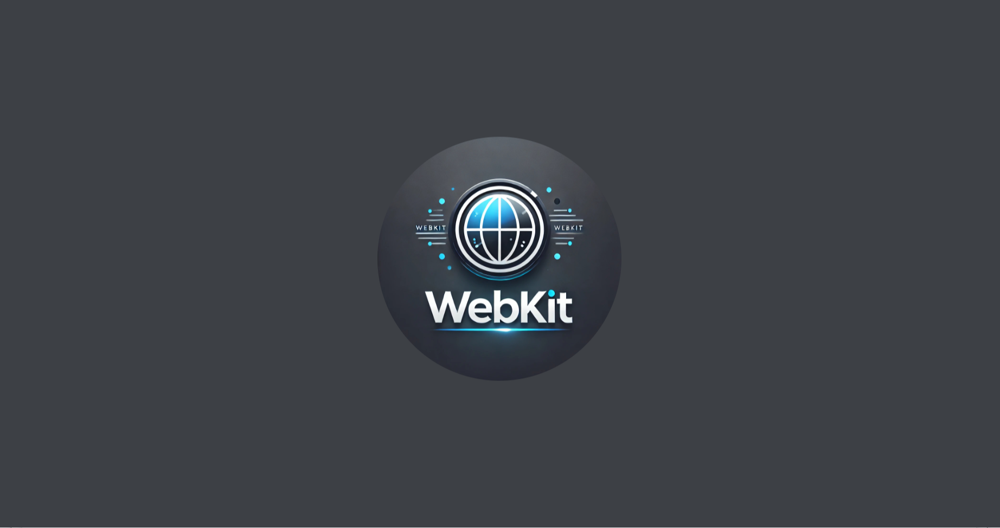
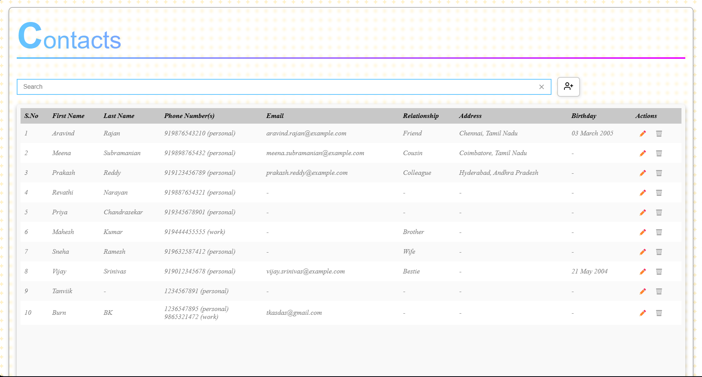
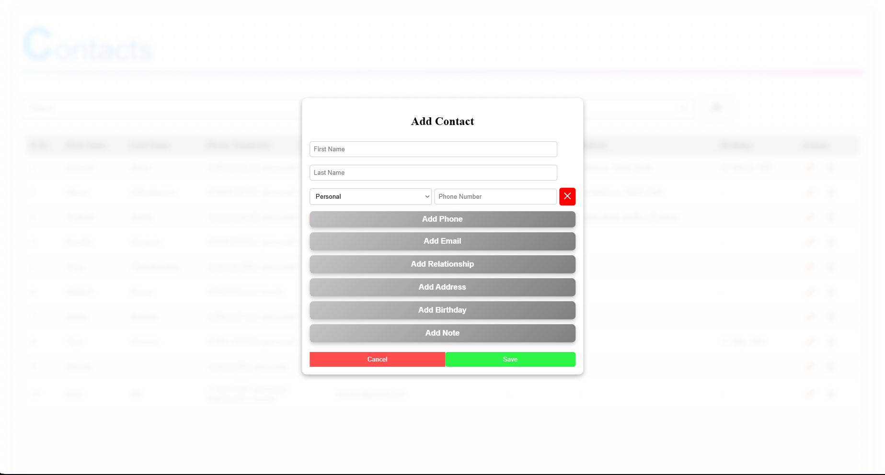
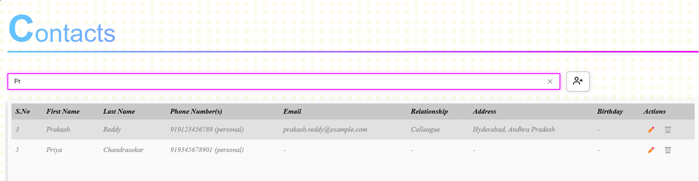

# Hackathon Projects Repository

Welcome to my **Hackathon Projects Repository**! 🎉 This repository is a collection of all my hackathon projects, starting with my **first hackathon** and growing with each new challenge I take on.

## 🚀 About This Repository
This repository serves as a central place for storing, showcasing, and documenting my hackathon projects. It will include:
- Source code for each hackathon project
- Documentation and project descriptions
- Screenshots and demos
- Learning experiences and improvements

## 📌 First Hackathon Project
### 🔹 Project Name: Basic Contact Manager
- **Hackathon Name:** *Hack&Build: Full-Stack Bootcamp*
- **Date:** *14th March 2025*
- **Tech Stack:** JavaScript, HTML, CSS, Express.js and Fetch API.
- **Rank:** *1*
- **Description:**
  The **Basic Contact Manager** is a simple web-based application designed to store and manage contact details. Users can add, edit, and delete contacts with details such as name, phone number, and email. The form submission is handled asynchronously using JavaScript's Fetch API, ensuring a smooth user experience. Validation is implemented to prevent incorrect or incomplete entries.

- **Features:**
  - Add new contacts with details like phone number, email, and relationship
  - Edit existing contacts by loading their details into the form
  - Delete contacts easily
  - Search functionality to filter contacts by name, phone number, or email
  - Form validation for proper input format

### 📷 Screenshots

    
    
    
    
    

---
Stay tuned for more awesome projects! 😃

